# PDF_POST_AI_CHATBOT - Full-Stack Application with React

This project is the frontend and backend part of a full-stack application built with React, Node.js, Express, and MongoDB. It implements a complex system architecture to manage PDF uploads, user authentication, and AI-driven chat functionalities.

## Features

- **User Authentication**: Secure login and registration with OTP verification.
- **PDF Management**: Upload, edit, and delete PDF files associated with user accounts.
- **AI Chatbot**: Interactive chatbot interface for user interaction.
- **Search Functionality**: Real-time search capabilities for finding user-related data.
- **Profile Management**: User profiles with the ability to update profile images.
- **Protected Routes**: Access control using JWT for route protection.

## Tech Stack

- **Frontend**: React, React Router, Context API
- **Backend**: Node.js, Express
- **Database**: MongoDB
- **Authentication**: JWT, Bcrypt
- **File Handling**: Multer
- **Environment Management**: dotenv

## Installation

### Prerequisites

- Node.js v14 or higher
- npm or Yarn
- MongoDB instance

### Setup

1. Clone the repository:

   ```bash
   git clone https://github.com/ArifRahaman/mongoDB-one-to-many-reference.git
   ```

2. Navigate to the project directory:

   ```bash
   cd mongoDB-one-to-many-reference
   ```

### Frontend

3. Navigate to the `frontend` directory:

   ```bash
   cd frontend
   ```

4. Install the dependencies:

   ```bash
   npm install
   ```

5. Start the frontend development server:

   ```bash
   npm run dev
   ```

### Backend

6. Navigate to the `backend` directory:

   ```bash
   cd backend
   ```

7. Install the dependencies:

   ```bash
   npm install
   ```

8. Start the backend server:

   ```bash
   npm start
   ```

## Usage Guide

- Access the application via `http://localhost:5173`.
- Register a new account or log in with existing credentials.
- Upload and manage your PDF files through the dashboard.
- Use the chatbot for interactive responses.
- Search for other users or content using the search bar.

## Environment Variables

Create a `.env` file in the `backend` directory and add the following variables:

- `MONGO_URI`: MongoDB connection string
- `JWT_SECRET`: Secret key for JWT token encryption
- `NODE_ENV`: Set to `development` or `production`

## API Reference

### User Authentication

- `POST /register`: Register a new user
- `POST /login`: User login
- `POST /verify-otp`: OTP verification

### PDF Management

- `POST /upload-pdf`: Upload a new PDF
- `GET /user-pdfs/:userId`: Retrieve PDFs by user
- `DELETE /delete-pdf/:id`: Delete a PDF by ID

### Profile Management

- `POST /upload-profile-image`: Upload or update a user's profile image

## Contributing

Pull requests are welcome. For major changes, please open an issue first to discuss what you would like to change.

## License

This project is licensed under the MIT License. See the LICENSE file for more information.

## Architecture

```mermaid
flowchart TD
    backend_controllers_Pdf_Pdf_js["Pdf/Pdf.js"]
    backend_controllers_Users_user_js["Users/user.js"]
    backend_models_Post_js["models/Post.js"]
    backend_models_employee_js["models/employee.js"]
    backend_models_pdf_js["models/pdf.js"]
    backend_utils_generateAuthTokenAndSetCookie_js["utils/generateAuthTokenAndSetCookie.js"]
    backend_utils_sendOTP_js["utils/sendOTP.js"]
    frontend_Context_AuthContext_jsx["Context/AuthContext.jsx"]
    frontend_src_App_jsx["src/App.jsx"]
    frontend_src_components_navbar_Navbar_jsx["navbar/Navbar.jsx"]
    frontend_src_components_userprofile_UserProfile_jsx["userprofile/UserProfile.jsx"]
    frontend_src_main_jsx["src/main.jsx"]
    frontend_src_pages_searchpage_SearchPage_jsx["searchpage/SearchPage.jsx"]

    frontend_src_App_jsx --> frontend_Context_AuthContext_jsx
    frontend_src_App_jsx --> frontend_src_pages_searchpage_SearchPage_jsx
    backend_controllers_Pdf_Pdf_js --> backend_models_pdf_js
    backend_controllers_Users_user_js --> backend_utils_sendOTP_js
    backend_controllers_Users_user_js --> backend_models_employee_js
    frontend_src_components_navbar_Navbar_jsx --> frontend_Context_AuthContext_jsx
    frontend_src_main_jsx --> frontend_Context_AuthContext_jsx
    frontend_src_main_jsx --> frontend_src_App_jsx
    frontend_src_components_userprofile_UserProfile_jsx --> frontend_Context_AuthContext_jsx

    classDef backend fill:#1a1a2e,stroke:#7c6cf8,color:#e8eaf6
    classDef frontend fill:#0d1b2a,stroke:#00e8a2,color:#e8eaf6
    classDef config fill:#1a0a0a,stroke:#f5a623,color:#e8eaf6
    class backend_controllers_Pdf_Pdf_js backend
    class backend_controllers_Users_user_js backend
    class backend_models_Post_js backend
    class backend_models_employee_js backend
    class backend_models_pdf_js backend
    class backend_utils_generateAuthTokenAndSetCookie_js backend
    class backend_utils_sendOTP_js backend
    class frontend_Context_AuthContext_jsx frontend
    class frontend_src_App_jsx frontend
    class frontend_src_components_navbar_Navbar_jsx frontend
    class frontend_src_components_userprofile_UserProfile_jsx frontend
    class frontend_src_main_jsx frontend
    class frontend_src_pages_searchpage_SearchPage_jsx frontend
```



---
> 🤖 *Last automated update: 2026-03-08 11:04:00*